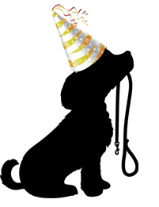
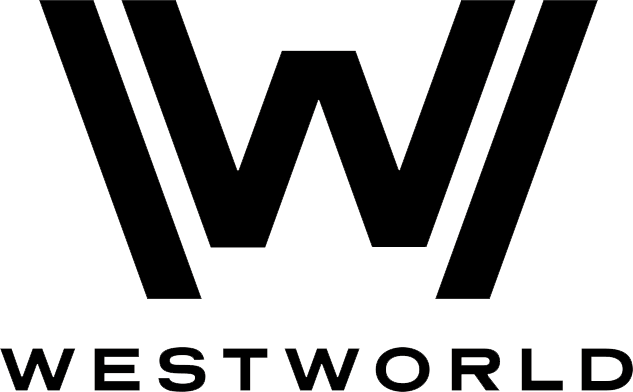
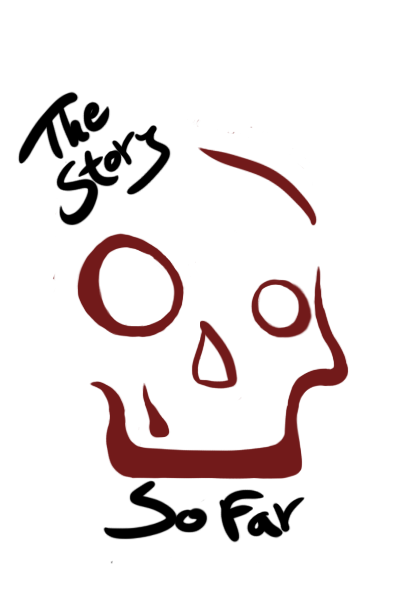
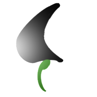



### Metacognition Testing App - Node.js Project

*A CRUD application made with Node.js*

[Git Repository](https://github.com/AAZWD/metacognition-testing-node.js "Git Repository Link")

#### Purpose
A testing platform for metacognition researchers
that require centralized access to metacognition tests, assessments, and cloud data storage for their studies.

#### Technologies
- Express.js
- Express-session
- MongoDB
- Mongoose
- Bootstrap
- Pug

### Party Animal: An Adoption Site - Relational Database Project

*A CRUD application made with PHP with a MySQL database*

[Git Repository](https://github.com/AAZWD/animal-shelter-relational-database "Git Repository Link")

#### Purpose
A functional animal adoption site. Created to practice building relational databases with PHP and MySQL on phpMyAdmin.

#### Technologies
- Javascript
- PHP
- SQL
- CSS

### Black Ridge Limited Booking Site - Asynchronous Website Project

*An asynchronous website for booking the Black Ridge Limited train*

[Git Repository](https://github.com/AAZWD/westworld-async-web-app "Git Repository Link")

#### Purpose
Fictional train booking/informational site based on the Westworld T.V series. Built to practice creating asynchronous websites with AJAX, PHP, and templating.

#### Technologies
-AJAX  
-PHP  
-SQL  
-Twig  
-Less  

### Haunted Story - Multimedia Project

*Simple website to host multimedia project*

[Git Repository](https://github.com/AAZWD/multimedia-narrative-design "Git Repository Link")

#### Purpose
A website created to host a multimedia project. Combines photo editing and narrative design.

#### Technologies
-Javascript
-HTML  
-CSS    
-Adobe Photoshop, Illustrator, XD 

### Song Selector - UI Design Project

*UI design practice*

[Git Repository](https://github.com/AAZWD/ui-practice "Git Repository Link")

#### Purpose
A site created to practice UI design. It randomly generateS preselected YouTube videos.

#### Technologies
-JavaScript  
-HTML  
-CSS   
-Adobe XD

### Acme Solutions - First Web Development Project

*An informational website for Acme Solutions, a Medical Startup*

[Git Repository](https://github.com/AAZWD/acme_solutions-informational-site "Git Repository Link")

#### Purpose
An informational site for Acme Solutions, a fictional pharmaceutical company looking for investors. My first completed website. 

#### Technologies
-Javascript  
-HTML  
-CSS   

<!--
bundle exec jekyll serve
-->

